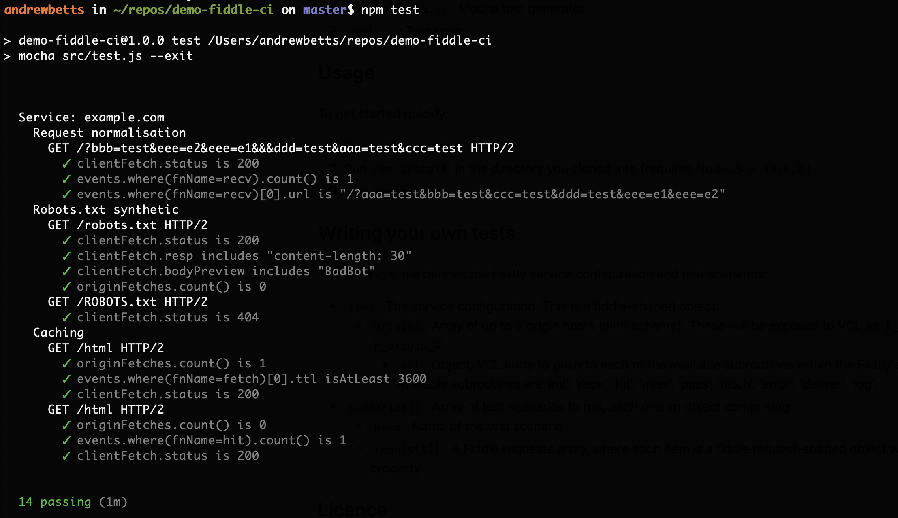

# Testing Fastly services in CI

This demo shows how to test Fastly services using [Mocha](https://mochajs.org) and [npm](https://npmjs.com/).

The solution comprises three parts:

1. `fiddle-client.js`: JavaScript HTTP client for Fastly fiddle
2. `fiddle-mocha.js`: Mocha test generator
3. `test.js`: Test spec

## Usage

To get started quickly:

1. Clone this repository
2. Run `npm install` in the directory you cloned into (requires [NodeJS](https://nodejs.org) `> 10.0,0`)
3. Run `npm test`

## Writing your own tests

The `test.js` file defines the Fastly service configuration and test scenarios:

* `spec`: The service configuration.  This is a fiddle-shaped object:
  * `origins`: Array of up to 5 origin hosts (with scheme). These will be exposed to VCL as `F_origin_0` up to `F_origin_4`
	* `vcl`: Object, VCL code to push to each of the available subroutines within the Fastly state machine.  Available subroutines are 'init', 'recv', 'hit', 'miss', 'pass', 'fetch', 'error', 'deliver', 'log'.
* `scenarios[]`: Array of test scenarios to run, each one an object comprising:
  * `name`: Name of the test scenario
  * `requests[]`: A Fiddle requests array, where each item is a fiddle request-shaped object with at least a `tests` property

## Licence

This code is available as open source under the terms of the [MIT License](http://opensource.org/licenses/MIT).
